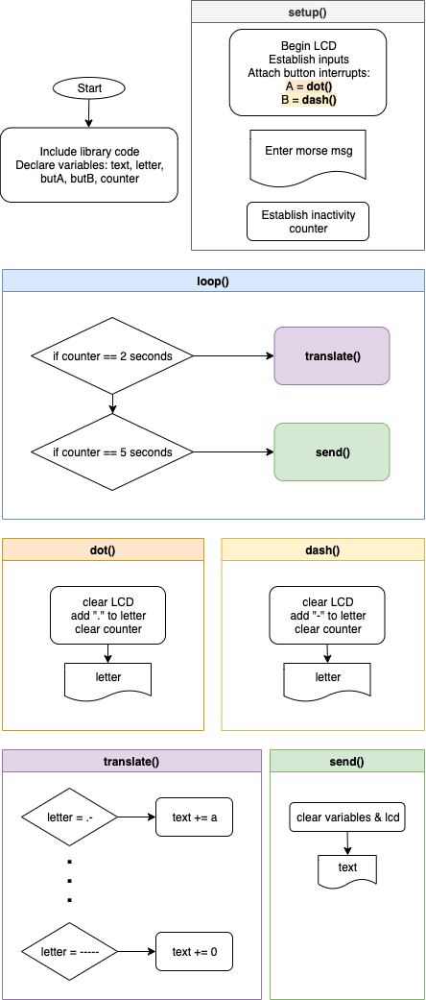

MARTIAN DECODER
===========================
A Communication method between Earth, Moon, and Mars in Arduino

Contents
-----
  1. [Planning](#planning)
  2. [Design](#design)
  3. [Development](#development)
  4. [Evalution](#evaluation)
  
  Planning 
  ----------
 
### Definition of the Problem

The year is 2050 and many people want to explore different planets, but one problem that they are facing is they can't communicate with other planets. This is happening due to lack of developing advance communicating tools. We are assigned to make a communicating tool that connect Earth, Moon, and Mars. Since its hard to transfer all the data from Earth to Mars, we made moon be the mediator of Earth and Mars. The people in Mars wanted all their communicaton system as Binary Code and for people in the moon to transfer the informaion from Earth to Binary Code they require the communication system from eath be Morse Code. The reverse has to happen to, Mars people will send binary Code to moon and moon peoeple will convert binary code to Morse code. 

A company called Mantion decided to send astronauts to moon and Mars but they are lucking one important componant to make their trip possible. This componant is communication, for the company to communicate with their astronauts and record all their discoveries and help them with their need, they strongly require a communication system. The owner of the Mantion seeked for communication developers and here he found us. After we had a little interview with him, we gathered that the communication system that he requires has to be developed in a way that his astronauts don't have to struggle learning it. This means that the communication system need to be simple. Another thing that we gathered after talking to him is that his communication system need to have only two buttons to limit number of buttons they will use. HE STATED THAT MORE INFORMATION ABOUT THE CRITERIA OF THE COMMUNICATION SYSTEM WILL ARRIVE. 

### Proposed Solution
As we have gathered enough information about the communication system, we decided to come up with a proposed solution. The communication system need to be created with Arduino rather than Bash, to check the reason why REFERT to Comparison between Bash and Arduino. We create a code that runs like a matrix and you use one of the buttons as to change the letters, numbers, SEND, SPACE, and DELETE. The other button, you use it to select the letter, number, SEND, SPACE, or DELETE when you are writing your message. One way we will make this possible is by using Binary system which will allow us to send those messages. Since the only way that the stations could communicate is by using our communication system, what would happen if the communication system fails? This will cause the astronauts to be out of communication and things could turn out not so great for them. So to avoid any communication system fails, We will install a 100W light on every station which they will turn on eveytime they recieve a message from another station. This will prevent the sender to worry if their messages are recieved or not. MORE SOLUTION WILL COME WHEN ALL THE CRITEA IS DELIVERED.

**Evaluation of Arduino and Bash**

Arduino is more simpler than bash. When it comes to coding, arduino seems to be easier and more understandable, while bash is a little bit complicated. One thing that makes Arduino more easeir is that the coding syntax is more relatable to other coding program like C and C++. But Bash has an advantage over Arduino, which is that you can use it anytime you want since its linked in your terminal. If you compare the varibales in Bash and Arduino, it feels like that Arduino's varaibles is a little bit complicated than Bash. When it comes to this communication system, Arduino has the advantage over Bash and the reason lies on 
the tools that Arduino provides. In arduino, you can find all the tools you need to make a communication system while in Bash you need to do more additional researches and convertions. You can code for arduino while you are checking if the communication system works which makes the programmer have easier time than using Bash. Overall, Arduino is more flexible than Bash when it comes to creating a physical object that is used for communication. 

Design
---------
### The system Diagram that we are creating will be set like figure 1.


**Fig. 1.** SYSTEM DIAGRAM 


### The flowchart in Figure 2 will show how the Code that converts English to Morse works. 


**Fig. 2.** English to Morse


### The Flowchart in figure 3 will show how the Code that converts Morse to English works.



**Fig. 3.** English to Morse


### The Flowchart in figure 3 will show how the Code that converts Binary to English works.


**Fig. 4.** Binary to English


### The Flowchart in figure 3 will show how the Code that converts English to Morse works.


**Fig. 5.** English to Binary


Development
--------

This code will print the table below in using LED.
The table in figure 1 give the user three buttons and also provides them the outputs if you press those buttons. For example, 
for the first row of the table, it shows that when you don't press any of the buttons, the output 1 and 2 are both 1 1, the outputs remain the same on the second row but this time you pressed button C. The remaing of the rows will follow the patterns.


**Fig. 1.** Table which shows which lights are on are which ones are off
``` Arduino
int butA = 13;
int butB = 12;
int butC = 11;
int out1 = 3;
int out2 = 4;

void setup()
{
  pinMode(butA, INPUT);
  pinMode(butB, INPUT);
  pinMode(butC, INPUT);
  pinMode(out1, OUTPUT);
  pinMode(out2, OUTPUT);
}

void loop(){

  if(digitalRead(butA)== LOW && (butB) == LOW && (butB) == LOW){
    digitalWrite(out1, HIGH);
    digitalWrite(out2, HIGH);
  }
  
  if(digitalRead(butA)== LOW && (butB) == LOW && (butB) == HIGH){
    digitalWrite(out1, HIGH);
    digitalWrite(out2, HIGH);
  }
  if(digitalRead(butA)== LOW && (butB) == HIGH && (butB) == LOW){
    digitalWrite(out1, HIGH);
    digitalWrite(out2, LOW);
  }
  if(digitalRead(butA) == LOW && (butB) == HIGH && (butB) == HIGH){
    digitalWrite(out1, HIGH);
    digitalWrite(out2, LOW);
  }
  if(digitalRead(butA) == HIGH && (butB) == LOW && (butB) == LOW){
    digitalWrite(out1, LOW);
    digitalWrite(out2, HIGH);
  }
  if(digitalRead(butA) == HIGH && (butB) == LOW && (butB) == HIGH){
    digitalWrite(out1, HIGH);
    digitalWrite(out2, HIGH);
  }
  if(digitalRead(butA) == HIGH && (butB) == HIGH && (butB) == LOW){
    digitalWrite(out1, HIGH);
    digitalWrite(out2, HIGH);
  }
  if(digitalRead(butA) == HIGH && (butB) == HIGH && (butB) == HIGH){
    digitalWrite(out1, HIGH);
    digitalWrite(out2, HIGH);
  }
}
```


**Traficlight**

WE created a trafic light using arduino and the figures 2 and 3 shows how it works. The lights will change depending on 
the timer that is assigned. for example, the red light will be on for 10 seconds and then it will shift to yellow which will be on for 5 seconds and then it will shift to green which will last for 10 seconds, and the vice versa will happen again from green to yellow and from yellow to red. 


**Fig. 2.** This figure shows an image of how the code below will turn out


**Fig. 3.** This figure shows an image of how the code below will turn out 

Code for trafic light

``` Arduino
nt redLight = 13; 
int yellowLight = 12;
int greenLight = 11;

void setup() {
  // the code would only run once
  pinMode(redLight, OUTPUT);
  pinMode(yellowLight, OUTPUT);
  pinMode(greenLight, OUTPUT); 
}

void loop() {
  // the code would run repeatedly
  blinkColor(1000, redLight);
  blinkColor(500, yellowLight);
  blinkColor(1000, greenLight);
}

void blinkColor(int t, int color) {
  digitalWrite(color, HIGH);
  delay(t);
  digitalWrite(color, LOW);
  delay(t);

```

**Convertion**

This code will convert decimal to binary but through LED. In figure 2 and 3, it shows how the code below convert 31 into 
Binary number by using lights. We assigned each light to do something while showing a binary number, the assigned actions 
are the lights to be off when they are showing 0 and be on while showing 1. An example is number 7, when the lights are showing number 7 in binary number, the first three lights on the right will be on while the two lights on the right will be off, showing a number like this 00111. So When you run the code, the lights will start as all off which is 00000 and then 
00001 and it will continue showing all decimal numbers from 1 to 31 in binary form using the lights. 


**Fig. 4.** This figure shows an image of how to convert 31 decimal to binary

Code for convertion

``` Arduino 

int ALED = 13;

int BLED = 12;

int CLED = 11;

int DLED = 10;

int ELED = 9;


void setup()
{
  pinMode(13, OUTPUT);
  pinMode(12, OUTPUT);
  pinMode(11, OUTPUT);
  pinMode(10, OUTPUT);
  pinMode(9, OUTPUT);
  
}

void loop()
{
  for (int j = 0; j <= 31; j++){
    delay(1000);
    digitalWrite(ALED, LOW);
    digitalWrite(BLED, LOW);
    digitalWrite(CLED, LOW);
    digitalWrite(DLED, LOW);
    digitalWrite(ELED, LOW);
    
    if (j % 2 != 0){
      digitalWrite(ELED, HIGH);
    }
    if (j % 4 > 1) {
      digitalWrite(DLED, HIGH);
    }
    
    if (j % 8 > 3) {
      digitalWrite(CLED, HIGH);
    }
    if (j % 16 > 7) {
      digitalWrite(BLED, HIGH);
    }
    if (j % 32 > 15) {
      digitalWrite(ALED, HIGH);
    }
      }
}


```
This code will print all the numbers between 0 to 9 by using 
binary system. We have three buttons and using those three
buttons we need to turn the right lights to create the number that 
we want to show.

``` Arduino
int butA = 13;
int butB = 12;
int butC = 11;
int outa = 7;
int outb = 6;
int outc = 5;
int outd = 4;
int oute = 3;
int outf = 2;
int outg = 1;

void setup()
{
  pinMode(butA, INPUT);
  pinMode(butB, INPUT);
  pinMode(butC, INPUT);
  pinMode(outa, OUTPUT);
  pinMode(outb, OUTPUT);
  pinMode(outc, OUTPUT);
  pinMode(outd, OUTPUT);
  pinMode(oute, OUTPUT);
  pinMode(outf, OUTPUT);
  pinMode(outg, OUTPUT);
}

void loop()
{
  bool A = digitalRead(butA);
  bool B = digitalRead(butA);
  bool C = digitalRead(butA);
  
  bool eqa = B || (!A && !C) || (A && C);
    
  digitalWrite(outa, eqa);   
  
  
  bool eqb = !A || (C && B) || (!B && !C);
    
  digitalWrite(outb, eqb);  

  
  bool eqc = (!A && !B) || C || (A && !C);
    
  digitalWrite(outc, eqc);  
  
  bool eqd = (!A && !C) || (!A && B) || (B && !C) || (A && !B && C);
    
  digitalWrite(outd, eqd);  
  
  bool eqe = (!A && !C) ||  (!A && B);
    
  digitalWrite(oute, eqe);  
  
  bool eqf = (A && !B) || !C;
    
  digitalWrite(outf, eqf);  
  
  bool eqg = (A && !C);
    
  digitalWrite(outg, eqg);  
}

```
**The Code for the Metrix**

The code below shows the metrix that the astronauts will use to send messages.
They will need to use two buttons, one for changing characters, and the other 
one for selecting the character. 
``` Arduino
/*This program will print the chosen letters and action through 
selecting the provided String.*/
String text = "";
int index = 0; 
// add all the letters and digits to the keyboard
String keyboard[]={"E", "T", "A", "O", "I", "N", "S", "R", "H", "L", "D", "C", "U", "M", "SENT", "DEL", "SPACE", "F", "P", "G", "W", "Y", "B", "V", "K", "X", "J", "Q", "Z", "O", "1", "2", "3", "4", "5", "6", "7", "8", "9"};
int numOptions = 39; 

void setup()
{
  Serial.begin(9600);
  attachInterrupt(0, changeLetter, RISING);//button A in port 2
  attachInterrupt(1, selected, RISING);//button B in port 3
}

void loop()
{
  Serial.println("Option (Select:butB, Change:butA): " + keyboard[index]);
  Serial.println("Message: "+ text);
  delay(100);
}

//This function changes the letter in the keyboard
void changeLetter(){
  index++;
/* This if function brings the index to 0 whenever the 
numOptions exceeds the fixed number that is used for the coding,
This will prevent the index to not exceed the numOption 
because there will not be anything after the fixed number 
of numOption */  
  if(keyboard == “DEL”){
     int len= text.length();
     text.remove(len-1);
  }

  else if(keyboard == “SEND”){
     Serial.println(“Message sent”);
     text=””:
  }

  else {
      text += key:
  }
  index=0:
}
```
### Usibility
According to Techopedia [1] "Usability is the degree of ease with which products such as software and Web applications can be used to achieve required goals effectively and efficiently."
### Discoveribility Feedback
To understand Discoveribility Feedback you need to first understand the words individually and then it will make sense when 
you combine them together. Discoveribility is the idea of "What do I do", this happens when you encounter a product, system or an object. Understanding what to do with a product or system is a major thing for the developers who want to produce a new
product into the world, and that is how Discoveribilty is important. Feedback comes when you make your product or create your new system. The developers need to understand what happened to their new product or their new system, and that is when feedback comes. It informs everything that happened to their products and how they need to improve it in the future for their clients. Discoveribility Feedback is the process of coming up with an idea then making it possible through a series of feedback that would improve the product. 


Evaluation
-----------
(coming soon )


## Reference
-----------

[1] “What Is Usability? - Definition from Techopedia.” Techopedia.com, https://www.techopedia.coum/definition/4919/usability.
[2] "What is Discoveribility Feeback - Definition from envatotuts+." webdesign.tutsplus.com, https://webdesign.tutsplus.com/articles/discoverability-and-feedback-in-web-design--cms-25487.


